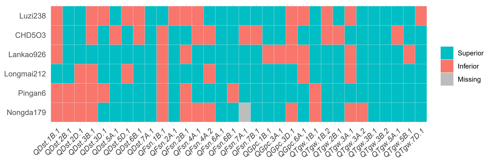

# Select-Candidate-Parents-tool
**Select Candidate Parents (SCP) tool** is developed for the selection of candidate parents and breeding schemes, estimation of breeding population size, and achieving the pyramiding of superior alleles.


## Installation

**SCP tool**  can be installed with the following R code:
```
git clone https://github.com/XiaoboMMSelect-Candidate-Parents-tool.git
```
## Example

There are four example datasets attached in SCP tool, , users can export and view the details by following R code:
```
#The genotype of the materials at the instresting QTL and genes.
> genotype_pop <- read.csv("https://raw.githubusercontent.com/XiaoboMM/Select-Candidate-Parents-tooll/master/data/genotype_pop.csv", header = T, check.names = F)
> genotype_pop[(1:5), c(1:5)]
  Trait     QTL       Jimai22 Jinan13 04zhong36
1   DST   QDst.1B.1       1       2         2
2   TGW   QTgw.1B.1       2       2         1
3   GPC   QGpc.1B.1       2       2         1
4   FSN   QFsn.1B.1       2       2         2
5   TGW   QTgw.1B.2       1       1         1

The character format of genotype data to numeric codes of 0, 1 and 2 representing missing, superior alleles and inferior alleles, respectively.
```


```
## The detailed information of QTL and genes
> qtl <- read.table("https://raw.githubusercontent.com/XiaoboMM/Select-Candidate-Parents-tool/master/data/QTL.txt", sep = "\t", check.names = F, header = T)
> head(qtl)
  Trait       QTL       Chromosome  Physical_position
1   FSN    QFsn.1B.1         1B            667.97
2   FSN    QFsn.2A.1         2A            675.94
3   FSN    QFsn.2B.1         2B            439.23
4   FSN    QFsn.4A.1         4A            616.31
5   FSN    QFsn.4A.2         4A            726.22
6   FSN    QFsn.6A.1         6A            520.88

As the example dataset, the first four columns are names, related-traits, chromosomes, physical positions (Mb) of QTL and genes, respectively.
```


```
#The general linkage map
> map <- read.csv("https://raw.githubusercontent.com/XiaoboMM/Select-Candidate-Parents-tool/master/data/general_linkage_map.csv", header = T)
> head(map)
  Chromosome Physical_position Genetic_position
1         1A                 0             0.00
2         1A                 1             0.94
3         1A                 2             1.02
4         1A                 3             1.72
5         1A                 4             2.30
6         1A                 5             2.88

As the example dataset, the three columns are chromosomes, physical positions (Mb) and genetic position (cM), respectively.
```


```
## The genetic position of QTL and genes
qtl$Physical_position <- round(qtl$Physical_position)
qtl_file <- merge(qtl, map, by = c("Chromosome", "Physical_position"), all.x = T)%>%
  select(Trait, QTL, Chromosome, Genetic_position)
> head(qtl_file)
   Trait      QTL      Chromosome    Genetic_position
1   DST    QDst.1B.1         1B             0.32
2   TGW    QTgw.1B.1         1B            18.86
3   GPC    QGpc.1B.1         1B            20.98
4   FSN    QFsn.1B.1         1B            77.74
5   TGW    QTgw.1B.2         1B            77.74
6   FSN    QFsn.2A.1         2A            69.83

```


```
#Target traits
> trait_type <- read.table("https://raw.githubusercontent.com/XiaoboMM/Select-Candidate-Parents-tool/master/data/Trait_Type.txt", header = T, sep = "\t")
> head(trait_type)
  Trait Target
1   FSN    Yes
2   TGW    Yes
3   DST     No
4   GPC     No

“Yes“ in the second column, corresponds to the trait to be improved in the first column.
“No“ in the second column, corresponds to the trait to be maintained in the first column.
```

## CandidateParentSelection

The parent to be improved needs to be provided. For example, P1 = "Nongda179"
```
source("https://raw.githubusercontent.com/XiaoboMM/Select-Candidate-Parents-tool/master/CandidateParentSelection.R")
P1 = "Nongda179"
percent_T1 = 0.1
percent_T2 = 0.25
percent_all = 0.45
parentSelection(P1 = P1, genotype_pop = genotype_pop, trait_type = trait_type, 
                percent_all = percent_all, percent_T1 = percent_T1, 
                percent_T2 = percent_T2)

#percent_T1: Potential parental lines in the top percentage (10%) for the number of complementary superior allele QTL compared to "Nongda179" in the first desired trait for improvement (FSN in this example)；
#percent_T2: The retained potential parental lines in the top percentage (25%) for the number of complementary superior allele QTL compared to "Nongda179" in the second desired trait for improvement (FSN in this example).
#Note: BDS tool provides up to 6 desired trait.
#percent_all: The retained potential parental lines in the bottom percentage (45%) for the number of different allele QTL compared to "Nongda179" in all the target traits.
```
**[The distribution of allelic types of “Nongda179” and its five potential hybrid parents](https://raw.githubusercontent.com/XiaoboMM/Select-Candidate-Parents-tool/master/data/Figure1.jpg)**
<p align="center">
<a href="https://raw.githubusercontent.com/XiaoboMM/Select-Candidate-Parents-tool/master/data/Figure1.jpg">

</a>
</p>

Blue, red and gray color represent superior, inferior and missing alleles, respectively.


## PopulationSizeEstimation
```
source("https://raw.githubusercontent.com/XiaoboMM/Select-Candidate-Parents-tool/master/PopulationSizeEstimation.R")
selected_pop <- read.table("selected_pop.txt", header = T, sep = "\t")
startDesign(P1, selected_pop, qtl_file, pop_file)

#Note: File "selected_pop.txt" is the result file of the parentSelection step.

```


|Scheme|Pingan6|Longmai212|Lankao926|CHD5O3|Luzi238|
|--|--|--|--|--|--|
|F<sub>1</sub>DH|637|1029|222194|559814|∞|
|F<sub>1</sub>RIL|593|1270|111314|217536|∞|
|BC<sub>1</sub>DH|4992|25633|2713146|1730278|∞|
|BC<sub>1</sub>RIL|5298|31616|1964644|1088109|∞|
|BC<sub>2</sub>DH|66245|1053890|95848590|26279757|∞|
|BC<sub>2</sub>RIL|73638|1299850|80066289|19812623|∞|
|F<sub>2</sub>|88716|230714|10720802510|68052587701|∞|
|BC<sub>1</sub>F<sub>2</sub>|4992|25633|2713146|1730278|∞|
|F<sub>2E</sub>|4|11|10|3|51|
|<sub>2E~DH|66|127|462|917|1601|
|F<sub>2E</sub>RIL|66|131|460|882|1616|
|BC<sub>1</sub>F<sub>2E</sub>|200|1912|2861|1903|10456|
|BC<sub>1</sub>F<sub>2E</sub>DH|45|70|1972|1655|∞|
|BC<sub>1</sub>F<sub>2E</sub>RIL|46|74|1650|1351|∞|
|BC<sub>2</sub>F<sub>2E</sub>|6174|93269|338097|264419|676480|
|BC<sub>2</sub>F<sub>2E</sub>DH|38|59|1218|650|∞|
|BC<sub>2</sub>F<sub>2E</sub>RIL|38|62|1060|553|∞|

Least population size required to obtain at least one target genotype (α = 0.01) in various progeny populations when using “Nongda179” as one parental line.  
#Note: <sub>E</sub> represents enrichment; ∞ represents the inability to obtain ideal genotype plant individual.

